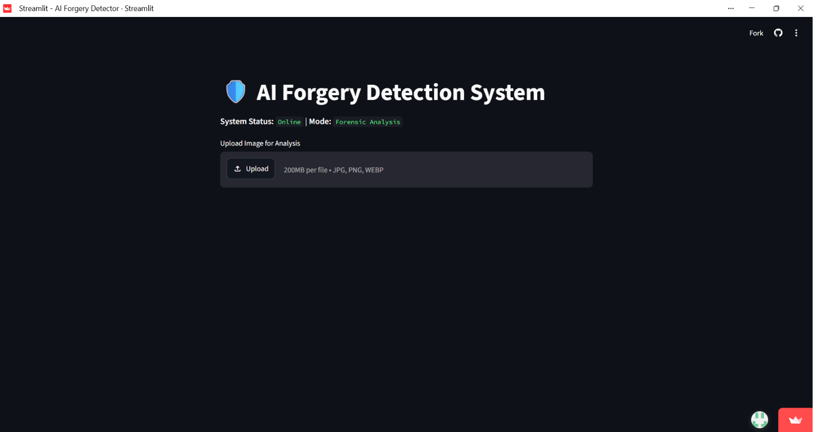
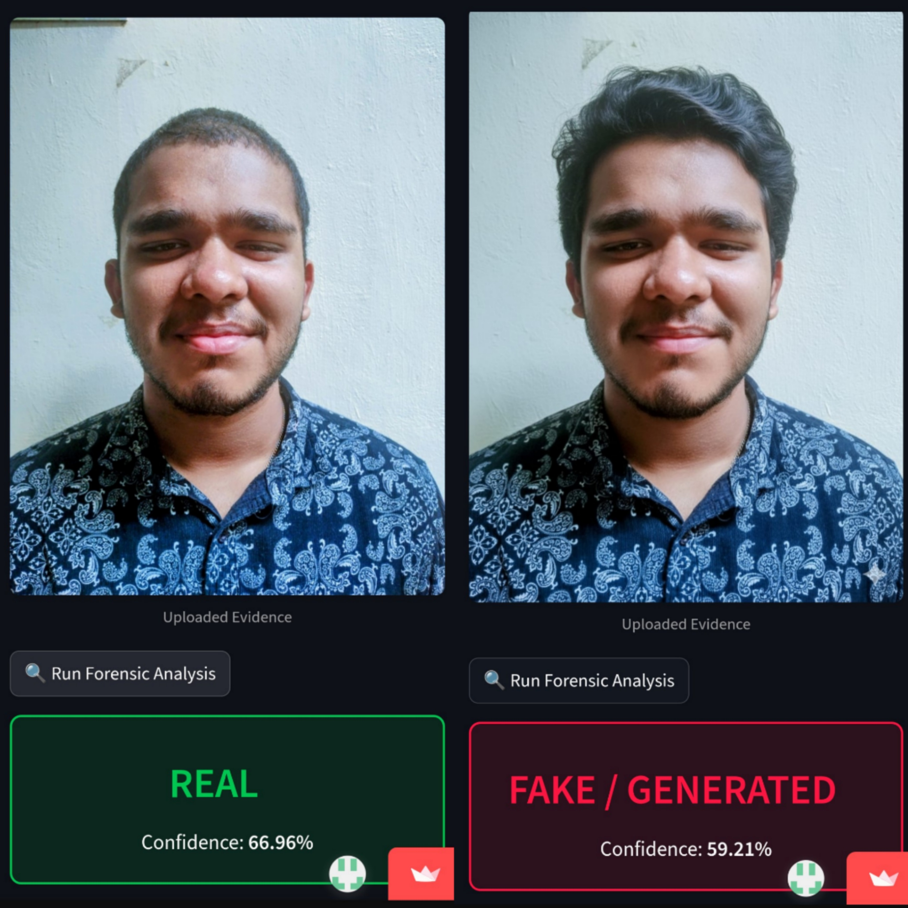

# 🛡️ NSA Image Forgery Detector

A deep learning-based web application for detecting AI-generated and manipulated facial images using **MobileNetV2**, **TensorFlow**, and **Streamlit**.

**Live Demo:** https://nsa-forensic-tool.streamlit.app/

---

## Project Overview

With the rapid growth of AI image generation tools, distinguishing between real and generated images has become increasingly important. This project was developed to classify facial images as **Real** or **Fake / AI-Generated** using a transfer learning approach based on MobileNetV2.

The trained model is deployed through a Streamlit web application where users can upload an image and receive a prediction with its confidence score. The application also includes a simple feedback mechanism that allows the model to learn from incorrect predictions.

---

## Features

- Detects Real and Fake / AI-generated facial images
- MobileNetV2 transfer learning model
- Streamlit-based web interface
- Confidence score for every prediction
- Image upload and preprocessing
- Active Learning (Correction Mode)
- Real-time prediction
- Trained model included in the repository

---

## Model Details

| Item | Description |
|------|-------------|
| Model | MobileNetV2 |
| Framework | TensorFlow & Keras |
| Dataset | 140K Real and Fake Faces Dataset |
| Image Size | 224 × 224 |
| Classification | Binary (Real / Fake) |
| Accuracy | **90.01%** |

---

## Application Preview

### Home Screen



---

### Prediction Result

The application predicts whether an uploaded image is **REAL** or **FAKE / GENERATED** and displays the prediction confidence.



---

## Repository Structure

```text
NSA-Image-Forgery-Detector
│
├── app.py
├── train_model.ipynb
├── best_model.keras
├── requirements.txt
├── home.png
├── prediction_result.png
└── README.md
```

---

## Installation

Clone the repository

```bash
git clone https://github.com/abhinendhu594/NSA-Image-Forgery-Detector.git
```

Move into the project folder

```bash
cd NSA-Image-Forgery-Detector
```

Install the required packages

```bash
pip install -r requirements.txt
```

Run the application

```bash
streamlit run app.py
```

---

## Technologies Used

- Python
- TensorFlow
- Keras
- MobileNetV2
- Streamlit
- NumPy
- Pillow

---

## Future Improvements

- Improve model accuracy using larger and more diverse datasets
- Support AI-generated video and deepfake video detection
- Add Explainable AI (Grad-CAM) for prediction visualization
- Enable batch image processing
- Deploy using scalable cloud infrastructure
- Support drag-and-drop image uploads
- Add REST API support for third-party integration
- Extend the system to detect manipulated videos frame by frame
---

## Author

**Abhinendhu**

B.Tech in Artificial Intelligence & Machine Learning

Mini Project

---

If you found this project useful, feel free to ⭐ the repository.
